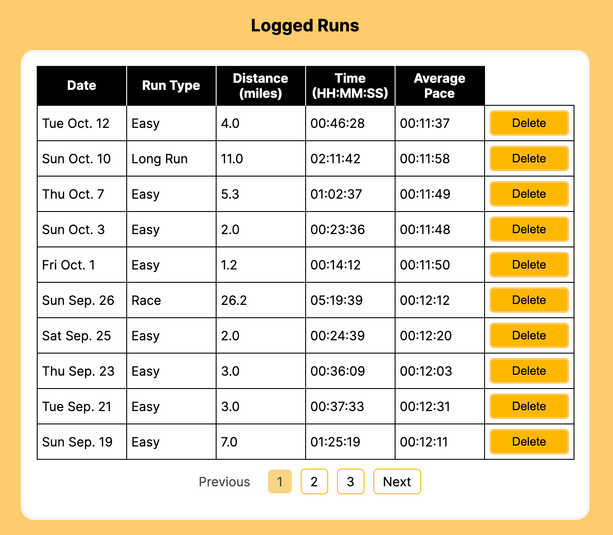
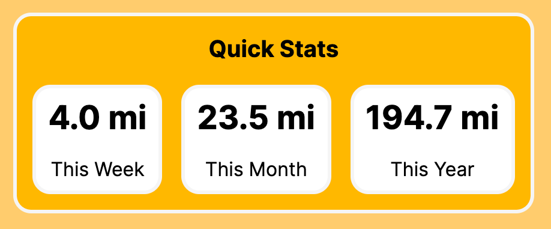

<h1 align="center"></h1>

Runlog is a simple web app to log running activities and view past data.

<b> 🔸 HTML  🔸 CSS  🔸 JavaScript  🔸 PHP  🔸 MySQL</b>

<h3> ✅ Current Features</h3>
<ul>
  <li>Add a running activity to the database</li> 
    
      
  <li>View previously logged activities in a paginated table</li> 
    
      
  <li>Delete an activity (with pop-up alert to confirm deletion)</li> 
  <li>Statistics for weekly/monthly/yearly mileage are automatically updated, stored, and displayed when an activity is added/deleted/update</li> 
    
</ul>

<h3> 🔮 Upcoming Features</h3>
<ul>
  <li>'Edit' button to make changes to any past activity</li>
  <li>Individual user registration and login</li>
  <li>Filter by various data (date range, run type, distance)</li>
  <li>Sort by column</li>
</ul>

<h3> 📖 Usage Instructions</h3>

<b>Note:</b> This application is not currently deployed to a web server. To use in its current state, you must have your own server set up.

<ol>
  <li>Clone repository to your local machine</li>
  <li>Run SQL file (runlog_db_init.sql) in MySQL to initialize local database</li>
  <li>Open index.php on your server</li>
 </ol>

<h3> 📷 Full Page Screenshot</h3>

  

